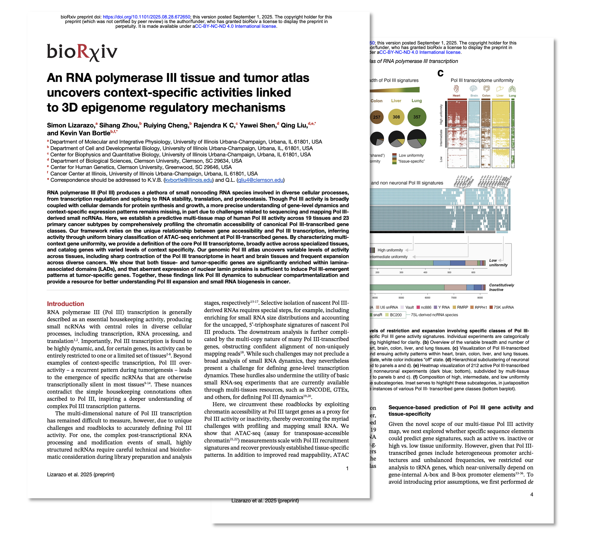

 # 

## Overview

We applied a uniform gene-centered framework for scoring RNA polymerase III (Pol III) activity at canonical Pol III-transcribed genes on the basis of chromatin accessibility measured using ATAC-seq. We specifically surveyed ATAC across large-scale data repositories and studies (ENCODE, The Cancer Genome Atlas, as well as GSE96949 and GSE164942) and infer active and inactive gene states following uniform scaling and saturation analysis (ATAC of insufficient depth and saturation at uniform scale were discarded). This repository specifically includes details and links to processed files related to our manuscript:

    An RNA polymerase III tissue and tumor atlas uncovers context-  
    specific activities linked to 3D epigenome regulatory mechanisms
    Simon Lizarazo, Sihang Zhou, Ruiying Cheng, Rajendra K C,   
    Yawei Shen, Qing Liu*, and Kevin Van Bortle*
    https://www.biorxiv.org/content/10.1101/2025.08.28.672650v1     
       
   
      

## Underlying Data

ATAC-seq FASTQ files were obtained from multiple sources (see below), and all technical replicates were aggregated per unique experiment:

Full list: Click [Here](https://github.com/VanBortleLab/Pol_III_tissue_tumor_atlas/blob/main/files_processing/files_metadata/Tissue_TCGA_Atlas_Samples_Metadata_All.txt)

Example list (<b>click to expand</b>) 

|    |Data_Reference                                                                 |Data_Origin |SRR_Sample  |File_Accession   |Experiment_Accession |Paired       |Nature |   Seqdepth| 
|:---|:------------------------------------------------------------------------------|:-----------|:-----------|:----------------|:--------------------|:------------|:------|----------:| 
|1   |ENCSR204SMO.heart_right_ventricle.1_1_1                                        |ENCODE      |SRR14102914 |ENCFF545CXV      |ENCSR204SMO          |paired-ended |fastq  |  413994397| 
|2   |ENCSR600ZHS.left_colon.1_1_2                                                   |ENCODE      |SRR14107548 |ENCFF250QRP      |ENCSR600ZHS          |paired-ended |fastq  |  830549969| 
|3   |ENCSR670REK.gastroesophageal_sphincter.1_1_1                                   |ENCODE      |SRR14107835 |ENCFF812DSG      |ENCSR670REK          |paired-ended |fastq  |  335818479| 
|4   |ENCSR685ZMP.right_lobe_of_liver.1_1_2                                          |ENCODE      |SRR14107867 |ENCFF450VXM      |ENCSR685ZMP          |paired-ended |fastq  | 1431172181| 
|5   |ENCSR542RNG.adrenal_gland.1_1_1                                                |ENCODE      |SRR14105636 |ENCFF915NRF      |ENCSR542RNG          |paired-ended |fastq  | 1133653640| 
|6   |ENCSR836FIL.right_lobe_of_liver.1_2_1                                          |ENCODE      |SRR14104225 |ENCFF395QVN      |ENCSR836FIL          |paired-ended |fastq  | 1310597965| 
|7   |ENCSR212LAZ.fallopian_tube.1_1_2                                               |ENCODE      |SRR14102989 |ENCFF517NJC      |ENCSR212LAZ          |paired-ended |fastq  |  731615963| 
|8   |ENCSR062SVK.right_atrium_auricular_region.1_1_1                                |ENCODE      |SRR10388415 |ENCFF138HVL      |ENCSR062SVK          |paired-ended |fastq  |  231569813| 
|9   |ENCSR584AXZ.coronary_artery.1_1_1                                              |ENCODE      |SRR14305353 |ENCFF049NKX      |ENCSR584AXZ          |paired-ended |fastq  |  173365413| 
|10  |ENCSR157OSO.heart_right_ventricle.1_1_1                                        |ENCODE      |SRR14105541 |ENCFF162IKK      |ENCSR157OSO          |paired-ended |fastq  | 3391149124| 
|158 |ATAC_brain_anterior_cingulate_cortex_Neuronal_male_age_19_untreated_1_1_1      |GSE96949    |SRR5367719  |                 |                     |paired-ended |fastq  |   65255993| 
|159 |ATAC_brain_anterior_cingulate_cortex_Neuronal_male_age_20_untreated_1_1_1      |GSE96949    |SRR5367767  |                 |                     |paired-ended |fastq  |  118013940| 
|160 |ATAC_brain_anterior_cingulate_cortex_Neuronal_male_age_22_untreated_1_1_1      |GSE96949    |SRR5367743  |                 |                     |paired-ended |fastq  |   62045998| 
|161 |ATAC_brain_anterior_cingulate_cortex_Neuronal_male_age_28_untreated_1_1_1      |GSE96949    |SRR5367790  |                 |                     |paired-ended |fastq  |   88409339| 
|162 |ATAC_brain_anterior_cingulate_cortex_NonNeuronal_female_age_22_untreated_1_1_1 |GSE96949    |SRR5367799  |                 |                     |paired-ended |fastq  |  163890003| 
|163 |ATAC_brain_anterior_cingulate_cortex_NonNeuronal_male_age_19_untreated_1_1_1   |GSE96949    |SRR5367708  |                 |                     |paired-ended |fastq  |  140691701| 
|164 |ATAC_brain_anterior_cingulate_cortex_NonNeuronal_male_age_20_untreated_1_1_1   |GSE96949    |SRR5367755  |                 |                     |paired-ended |fastq  |   67814502| 
|165 |ATAC_brain_anterior_cingulate_cortex_NonNeuronal_male_age_22_untreated_1_1_1   |GSE96949    |SRR5367730  |                 |                     |paired-ended |fastq  |  194833316| 
|166 |ATAC_brain_anterior_cingulate_cortex_NonNeuronal_male_age_28_untreated_1_1_1   |GSE96949    |SRR5367779  |                 |                     |paired-ended |fastq  |   96242436| 
|167 |ATAC_brain_basal_amygdala_Neuronal_female_age_22_untreated_1_1_1               |GSE96949    |SRR5367813  |                 |                     |paired-ended |fastq  |   86042109| 
|168 |ATAC_brain_basal_amygdala_NonNeuronal_female_age_22_untreated_1_1_1            |GSE96949    |SRR5367800  |                 |                     |paired-ended |fastq  |  142761664| 
|273 |Liver_female_16_753                                                            |GSE164942   |SRR13439643 |                 |                     |paired-ended |fastq  |  780743877| 
|274 |Liver_female_17_459                                                            |GSE164942   |SRR13439673 |                 |                     |paired-ended |fastq  |  779134143| 
|275 |Liver_female_17_651                                                            |GSE164942   |SRR13439649 |                 |                     |paired-ended |fastq  |  859281234| 
|276 |Liver_female_30_767                                                            |GSE164942   |SRR13439659 |                 |                     |paired-ended |fastq  |  835331203| 
|277 |Liver_female_35_662                                                            |GSE164942   |SRR13439657 |                 |                     |paired-ended |fastq  |  638017483| 
|278 |Liver_female_36_793                                                            |GSE164942   |SRR13439697 |                 |                     |paired-ended |fastq  | 1300560747| 
|279 |Liver_female_49_670B                                                           |GSE164942   |SRR13439648 |                 |                     |paired-ended |fastq  |  665074584| 
|280 |Liver_female_49_683                                                            |GSE164942   |SRR13439652 |                 |                     |paired-ended |fastq  |  748938713| 
|281 |Liver_female_50_485                                                            |GSE164942   |SRR13439684 |                 |                     |paired-ended |fastq  | 1038161477| 
|282 |Liver_female_7_438                                                             |GSE164942   |SRR13439667 |                 |                     |paired-ended |fastq  | 1200763517| 
|283 |Liver_male_16_786                                                              |GSE164942   |SRR13439633 |                 |                     |paired-ended |fastq  |  762385932| 
|357 |TCGA-BRCA-292                                                                  |TCGA        |            |TCGA-A2-A0ES-01A |                     |             |bam    |  212398446| 
|358 |TCGA-BRCA-293                                                                  |TCGA        |            |TCGA-A7-A0D9-01A |                     |             |bam    |  342554002| 
|359 |TCGA-BRCA-312                                                                  |TCGA        |            |TCGA-AO-A0JM-01A |                     |             |bam    |  228088663| 
|360 |TCGA-BRCA-313                                                                  |TCGA        |            |TCGA-A2-A0CX-01A |                     |             |bam    |  264429086| 
|361 |TCGA-BRCA-338                                                                  |TCGA        |            |TCGA-D8-A13Z-01A |                     |             |bam    |  392640294| 
|362 |TCGA-BRCA-339                                                                  |TCGA        |            |TCGA-A8-A08J-01A |                     |             |bam    |  310310191| 
|363 |TCGA-BRCA-347                                                                  |TCGA        |            |TCGA-A2-A0T7-01A |                     |             |bam    |  291812321| 
|364 |TCGA-BRCA-348                                                                  |TCGA        |            |TCGA-C8-A8HR-01A |                     |             |bam    |  253002378| 
|365 |TCGA-BRCA-349                                                                  |TCGA        |            |TCGA-A2-A4RX-01A |                     |             |bam    |  284238095| 
|366 |TCGA-BRCA-35                                                                   |TCGA        |            |TCGA-AR-A0TV-01A |                     |             |bam    |  275102145| 
|367 |TCGA-BRCA-36                                                                   |TCGA        |            |TCGA-A2-A0YD-01A |                     |             |bam    |  271172799|

  
  
  
  
# Data formats

**Tissue- and Tumor-annotated track files** that communicate the "ON" state of each canonical Pol III-transcribed gene class are available for browsing on IGV. In brief, gene sets corresponding to the tissue and tumor atlases described in Lizarazo et al. are compiled into a composite Bed files, with each entry denoting "ON" state in a corresponding tissue or tumor subtype. 

**[Click here](https://tinyurl.com/3672p6cr) (or the recording below) to instantly visualize these tracks on IGV**

   
   
